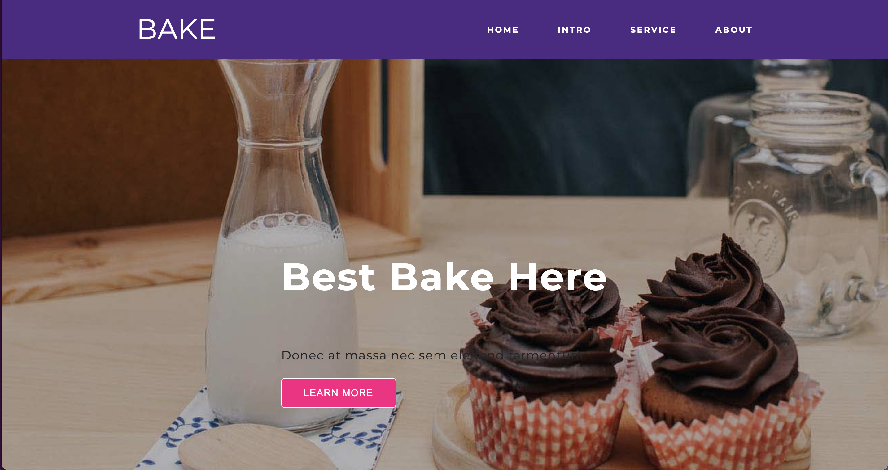
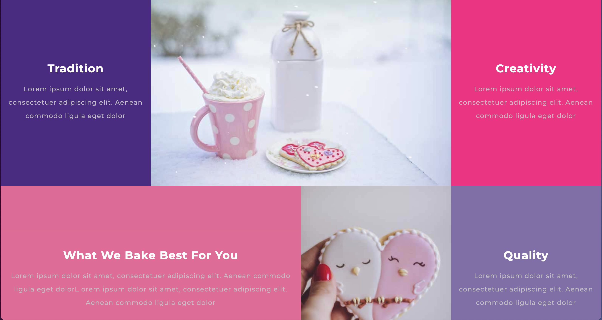
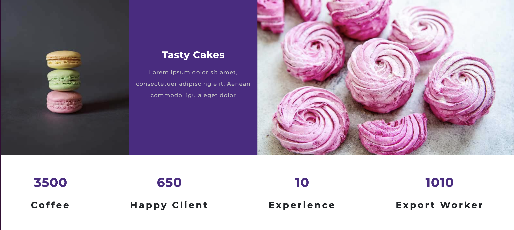

### Git assignment requirement

1. Requirements

- Use external styling
- Connect css file to the HTML file
- Try to recreate website as the screenshot below (you can change the color and the text but the format should be the same , feel free to add more content)
- Update the deploy link here: https://vit-byro.github.io/CSS/

2. Screenshot
   

   

   
